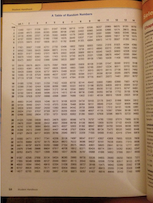

```{r setup, include=FALSE}
knitr::opts_chunk$set(echo = F, warning = F)
library(tidyverse)    # for data wrangling
library(magrittr)     # for pipes
library(knitr)        # for tables
library(kableExtra)   # for tables
library(DT)           # for interactive tables
library(ggplot2)      # for plots
library(plotly)       # for interactive plots
```

# Random Number Tables
## What are random number tables? | (Still Figure - Image)

<center>



Turns out that... \
A long time ago in a galaxy not so far away.... people had no computers. If they wanted to sample a random number, they had to use **random number tables**.

</center>


## Tell me more | (Bullet Points in 2 Columns)

<div class="columns-2">

- Used to draw random samples
- Said to be more effective than using dice or cards

- Became replaced by random number generators
- Archaeologists and historians of statistics are trying to decipher how exactly random number tables were used

</div>

<center>

</center>

## What did they look like? | (Still Figure - Knitr & KableExtra table)

```{r, tab.cap = "An example of a random number table"}
set.seed(42)

# create uniform matrix
knitr::kable(matrix(round(runif(n = 25, min = 10000, max = 99000),0), 5, 5)) %>%
 kable_styling(bootstrap_options = "striped", full_width = F)

```

Table 1: An example of a random number table. Shocking indeed.

## A Non-Random Table | (Static Figure - Pandoc Table)

+-+-+
|1|2|
+-+-+
|3|4|
+-+-+
|5|6|
+-+-+
|7|8|
+-+-+
Table 2: A not-so-random table.


## What is Random? <font size="5">(Embedded Video)</font>

<iframe width="560" height="315" src="https://www.youtube.com/embed/9rIy0xY99a0" title="YouTube video player" frameborder="0" allow="accelerometer; autoplay; clipboard-write; encrypted-media; gyroscope; picture-in-picture; web-share" allowfullscreen></iframe>


## Interact with Randomness I | (Interactive Table)
<center>
```{r}

random <- round(tibble("V1" = runif(5, 100, 999), "V2" = runif(5, 100, 999), "V3" = runif(5, 100, 999), "V4" = runif(5, 100, 999)))


datatable(random, width = 600, height = 400, caption = "Three Random Uniform Variables Between 100 and 999")
```
</center>

## Interact with Randomness II | (Interactive Plot)

```{r}
df <- data.frame(x <- runif(1000, 5, 10),
                 group <- sample(LETTERS[1:5], size = 1000, replace = T))

p <- ggplot(df, aes(x, fill = group)) +
  geom_density(alpha = 0.5, position = "stack") +
  ggtitle("Stacked Uniform Density Charts")

ggplotly(p)
```


## Formula for Randomness?

There is no math formula for generating truly random numbers. \

Instead, I share some formulas for the **continuous uniform distribution** from which we have been sampling today.


\[\begin{align}
 f(x) = \begin{cases} \frac{1}{b-a} & \text{for } a \leq x \leq b \ 
 0 & \text{for } x < a \text{ or } x > b \end{cases} \\
 f(x) = \begin{cases} \frac{1}{2\sigma\sqrt{3}} & \text{for } -\sigma\sqrt{3}\leq x - \mu \leq \sigma\sqrt{3} \\ 
 0 \text{ otherwise}\end{cases}
\end{align}\]

- The first formula is the probability density function
- The second formula is the probability density expressed in terms of mean \mu and variance $\sigma^2$ ("Continuous uniform distribution", 2023)
 
 

## Code for Sampling the Uniform Distribution | (Displayed but not Executed)

```{r, echo = T, eval=FALSE}
# set seed if you want
set.seed(42)

# sample 10  continuous values between 100 and a hundred
runif(10, 100, 999) 

# sample discrete values
round(runif(10, 100, 999),0)
```

## Bibliography


Continuous uniform distribution. (2023, 01, 21). In Wikipedia. https://en.wikipedia.org/wiki/Continuous_uniform_distribution
