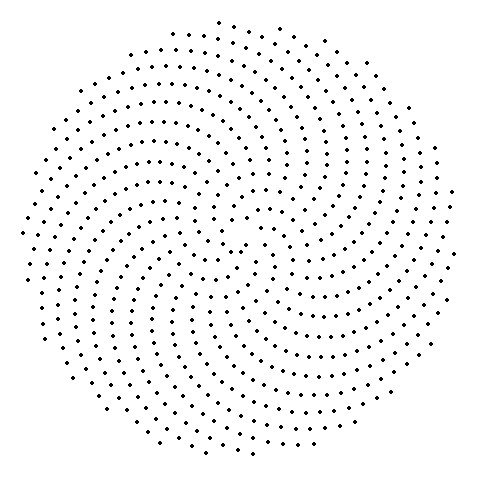

```{r setup, include=F}
knitr::opts_chunk$set(widgetframe_widgetsdir = 'widgets')
library(visNetwork, quietly = TRUE)
library(widgetframe)
frameWidget(visNetwork(data.frame(id = 1:3), data.frame(from = c(1,2), to = c(1,3))))
library(dplyr)
library(kableExtra)
library(tidyverse)
```

```{=html}
<style>
pre {
    line-height: 1.2em;
    font-size: 15px;
}
</style>
```
```{=html}
<style>
div.footnotes {
  position: absolute;
  bottom: 0;
  margin-bottom: 25px;
  margin-left: 40px;
  width: 80%;
  font-size: 0.6em;
}
</style>
```
```{=html}
<script src="https://ajax.googleapis.com/ajax/libs/jquery/3.1.1/jquery.min.js"></script>
```
```{=html}
<script>
  $(document).ready(function() {
    $('slide:not(.backdrop):not(.title-slide)').append('<div class=\"footnotes\">');

    $('footnote').each(function(index) {
      var text  = $(this).html();
      var fnNum = (index+1).toString().sup();
      $(this).html(text + fnNum);

      var footnote   = fnNum + ': ' + $(this).attr('content') + '<br/>';
      var oldContent = $(this).parents('slide').children('div.footnotes').html();
      var newContent = oldContent + footnote;
      $(this).parents('slide').children('div.footnotes').html(newContent);
    });
  });
</script>
```
## Definition

In mathematics, the Fibonacci sequence is made up from Fibonacci numbers, in which each number is the sum of the two preceding ones. The sequence commonly starts from 0 and 1, although some authors start the sequence from 1 and 1 or sometimes (as did Fibonacci) from 1 and 2. Starting from 0 and 1, the first few values in the sequence are <footnote content="The definition is coming from https://en.wikipedia.org/wiki/Fibonacci_number">here</footnote>:

$$0, 1, 1, 2, 3, 5, 8, 13, 21, 34, 55, 89, 144.$$ 

## A bit of history

::: {style="float: left; width: 60%;"}
The Fibonacci sequence first appears in the book *Liber Abaci* (*The Book of Calculation*, 1202) by Fibonacci [@Sigler_2002] where it is used to calculate the growth of rabbit populations [@Hemenway_2005]. Fibonacci considers the growth of an idealized rabbit population, assuming that: a newly born breeding pair of rabbits are put in a field; each breeding pair mates at the age of one month, and at the end of their second month they always produce another pair of rabbits; and rabbits never die, but continue breeding forever.
:::

::: {style="float: right; width: 38%;"}
```{r, out.width = "95%",echo=FALSE}
knitr::include_graphics("https://upload.wikimedia.org/wikipedia/commons/0/04/Liber_abbaci_magliab_f124r.jpg")
```
:::

## Publications

The Fibbonacci sequence is popular topic of research and below you can see a table with a few examples of such publicationas.

```{r, echo=FALSE,results='hide', warning=FALSE, message=FALSE}
library(here)
library(readr)

citations <- read_csv("citations.csv", col_types = cols(Volume = col_integer(), 
    Number = col_integer())) %>% as.data.frame()

```

```{r,echo=FALSE}
library(DT)

datatable(citations, options = list(pageLength = 5))
```

## Fibbonacci sequence in equations

$$\begin{equation}
  \begin{aligned}
       \text{Given} \,\, f_1=1,f_2=1, \text{then}\\
        f_3=f_2+f_1=1+1=2,\\
        f_4=f_3+f_2=2+1=3,\\
        f_5=f_4+f_3=3+2=5,
    \end{aligned}
\end{equation}$$

## Interactive plot 

```{r, fig.align='center', message = FALSE,echo=FALSE,warning=FALSE}
library(plotly)

df <- data.frame(x =  1:10, y = (1:10)^2)

p <- ggplot(df, aes(x = x, y = y)) + geom_line() + labs(x = "X", y = "Y", title = "X and Y")

ggplotly(p)

```

## Slide with R 

```{r chunk,results='hide'}
# take input from the user
nterms = 10
# first two terms
n1 = 0
n2 = 1
count = 2
# check if the number of terms is valid
if(nterms <= 0) {
print("Plese enter a positive integer")
} else {
if(nterms == 1) {
print("Fibonacci sequence:")
print(n1)
} else {
print("Fibonacci sequence:")
print(n1)
print(n2)
while(count < nterms) {
nth = n1 + n2
print(nth)
# update values
n1 = n2
n2 = nth
count = count + 1
}
}
}
```

## Slide with Plot

Here we can see an animation of spirals generated with Fibonacci sequences.

```{r chunk-label, eval=FALSE,include=FALSE,cache=TRUE}
library(gganimate)
library(ggplot2)
library(tidyverse)

data<-data.frame()

for(k in 5:20){
  golden.ratio = (sqrt(k) + 1)/2
fibonacci.angle=360/(golden.ratio^2)
c=1
num_points=630
x=rep(0,num_points)
y=rep(0,num_points)
for (n in 1:num_points) {
    r=c*sqrt(n)
    theta=fibonacci.angle*(n)
    x[n]=r*cos(theta)
    y[n]=r*sin(theta)
}
new<-data.frame(x=x,y=y,theta=as.factor(rep(theta,num_points)))
data<-rbind(data,new)
}
data %>% ggplot(aes(x=x,y=y))+geom_point()+theme_void()+
transition_states(
    theta,
    transition_length = 2,
    state_length = 1
  ) +
  enter_fade() + 
  exit_shrink() +
  ease_aes('sine-in-out')

anim_save("tx-sales-gganimate.gif")


```

<center>

```{r, out.width="40%", fig.cap="Fibonacci spirals",echo=FALSE}
  

```

</center>

## References
