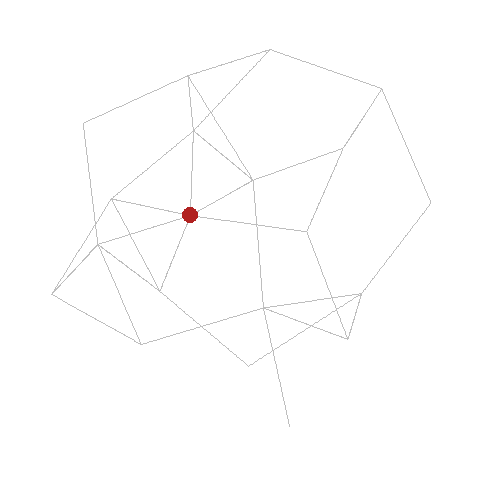
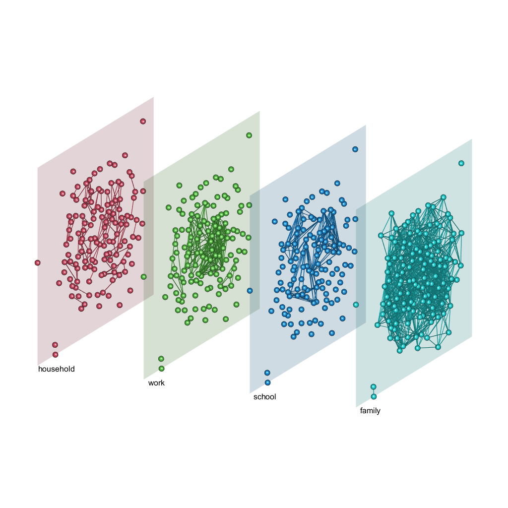
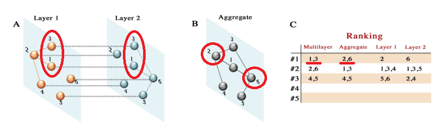
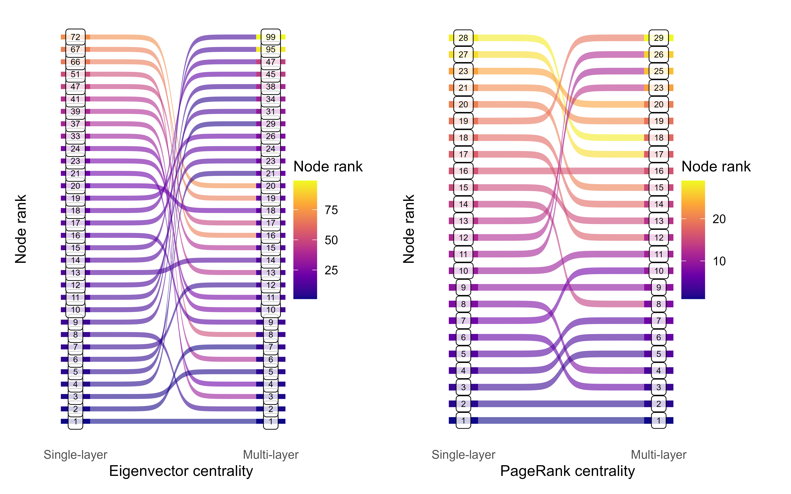

class: center, middle, inverse

```{r setup, include=FALSE}
options(htmltools.dir.version = FALSE)

knitr::opts_chunk$set(echo = FALSE)

library(xaringan)
library(igraph)
library(ggraph)
library(gganimate)
```

# Let's break it down:

---
class: center, middle, inverse

# **Predicting Covid-19 outbreaks** <span style = "color:darkslategray";> using multi-layer centrality measures </span>

---
class: middle

.pull-left[.center[
```{r, out.width="100%"}
# make sample graph
set.seed(789)
g <- sample_gnm(n = 20, m = 35)
#plot(g)

# order nodes by degree
g <- permute(g, Matrix::invPerm(order(degree(g), decreasing = TRUE)))
V(g)$names <- 1:20

# assign time of infection to nodes
V(g)$inf_time <- c(1,2,2,4,3,5,3,5,3,3,5,4,5,6,6,3,7,5,7,8)  

if (!file.exists("img/net_animation.gif")) {
  # make animated plot
  p <- ggraph(g, layout = "stress") +
    geom_edge_link(color = "gray") +
    geom_node_point(aes(group = inf_time),
                    color = "firebrick", size = 7) +
    theme_graph(background = "transparent") +
    coord_fixed() +
    theme(rect =  element_rect(fill = "transparent")) +
    transition_time(inf_time) +
    enter_fade() +
    shadow_mark()
    
  anim_save("img/net_animation.gif", bg = 'transparent', p)
}


```
]]

### <p style="margin:250px 0px 0px 550px"> Model spread to inform policy decisions! </p>

---
class: center, middle, inverse

# <span style = "color:darkslategray";> Predicting Covid-19 outbreaks using </span> **multi-layer** <span style = "color:darkslategray";> centrality measures </span>

---
class: left, top

### Our lives are multi-layered.



<p style="margin:-400px 0px 0px 800px"> 
<b> CBS micro-data </b> allows to construct multi-layer network data set. <br><br> 
Micro-data can be linked to <b> PCR test data. </b> <br><br> 
Analyses conducted on regional <b> sample </b>.
</p>

---
class: center, middle, inverse

# <span style = "color:darkslategray";> Predicting Covid-19 outbreaks using multi-layer  </span> **centrality measures**

---
class: center, left

### Do you have...

<p style="font-size:25px; text-align:left">
👩👴👶👦...many close relatives?  <br><br>

👩👴👶👦 👭 👧👴👵👦...many close relatives and also a partner with a big family? <br><br>

✈️🌍 👩👴👶👦...many close relatives, but they live in a different place? <br>

</p>

<br>

## **Then you are central!**

--

<br>

## ... and probably a super-spreader.

---
class: center, middle, inverse

# **Single-layer centrality <br> &#8800; <br> Multi-layer centrality **

---
class: left, middle

<figure>

<figcaption style="font-size:15px"> <i>De Domenico et al. 2015, Supplementary Figure 1</i> </figcaption> 
</figure>

<br><br>

----

<p style="font-size:15px">De Domenico, M., Solé-Ribalta, A., Omodei, E., Gómez, S., & Arenas, A. (2015). Ranking in interconnected multilayer networks reveals versatile nodes. Nature Communications, 6(1), 6868. https://doi.org/10.1038/ncomms7868 </p>


---
class: left, top, inverse

## **Bringing it all together:**

<br>
> ### In single-layer networks, a relevant indicator of spreading behavior has shown to be the **centrality** of a node.

> ### Several studies have used **multi-layer** networks in modeling the spread of Covid.

> ### **None** of them have included multi-layer centrality measures that adequately **account for the complex network structure**. 

---
class: center, middle, inverse

# **Preliminary Results**

---
class: center

### *Ranking nodes*: Single-layer vs. Multi-layer centrality




---
class: top, left

## What is **next**:
<br>

> ### 1. **Simulate** outbreak
> ### 2. **Predict** time point of infection with multi-layer measures
> ### 3. **Optimize** prediction in a newly created measure
> ### 4. **Test** performance of new measure under different epidemic scenarios


--
<br>
## *5. Tell you what I found!*

