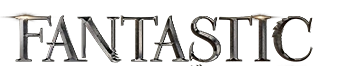

# Introduction

## What are cats?

<center>
   
</center>

## Cats Data

```{r echo=FALSE, message=FALSE, warning=FALSE}
data <- read.csv("data/cats.csv")
data <- data[sample(nrow(data), 100),]

library(DT)
library(tidyverse)

data %>% 
   select(age, gender, size, breed) %>%
   datatable(options = list(pageLength = 7)) 
```

## Cats Figure

```{r echo=FALSE, message=FALSE, warning=FALSE}
library(ggplot2, warn.conflicts = FALSE)
library(plotly, warn.conflicts = FALSE)

p <- data %>% 
   mutate(age_numeric = ifelse(age == "Baby", 3, 
                        ifelse(age == "Young", 6,
                        ifelse(age == "Adult", 9, 12)))) %>%
   ggplot(aes(x = size, y = age_numeric)) +
   geom_bin2d() + 
   labs(x = "cat size", y = "age") +
   theme_bw()
p %>% ggplotly()
```

## Cats Described in Two Words

<div style="float: left; width: 50%;">
{width=100%}
</div>

<div style="float: right; width: 50%;">
{width=100%}
</div>

## Schrödinger's cat

$$
\begin{aligned}
 ih\frac{\partial }{\partial t} \Psi (x,t) &= \left[ - \frac{h^2}{2m} \frac{\partial^2}{\partial x^2} + V(x,t)\right] \Psi (x,t) \\
 ih\frac{\partial }{\partial t} \Psi (x,t) &= \frac{1}{\sqrt2}|\text{alive}\rangle + \frac{1}{\sqrt2}|\text{dead}\rangle
\end{aligned}
$$

@schrodinger1980present

## Code

```{r eval=FALSE, include=TRUE}
nr_cats_alive <- .Machine$double.xmax
```

## Cat Figure 2

```{r echo=FALSE, cache=FALSE}
ggplot(data, aes(x = age, y = gender)) + 
   geom_bin2d() +
   theme_bw()
```

## Biography

<div id="refs"></div>