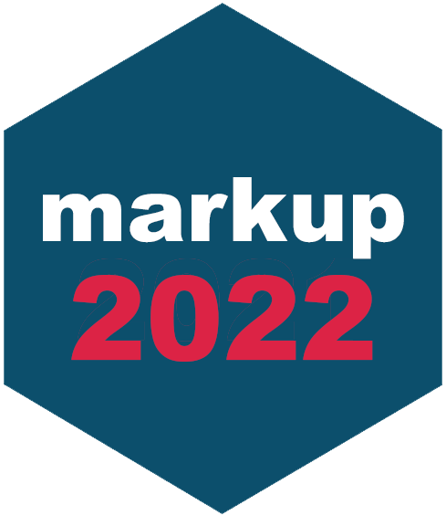

---
output:
  md_document:
    variant: gfm
---

<!-- README.md is generated from README.Rmd. Please edit that file -->

```{r, echo = FALSE}
knitr::opts_chunk$set(
  collapse = TRUE,
  comment = "#>",
  fig.path = "README-"
)
options(width = 60, digits = 3)
```

# markup 2022 <a href='https://github.com/gerkovink/markup2022'></a>


Course collaboration for 202000010. 

---

