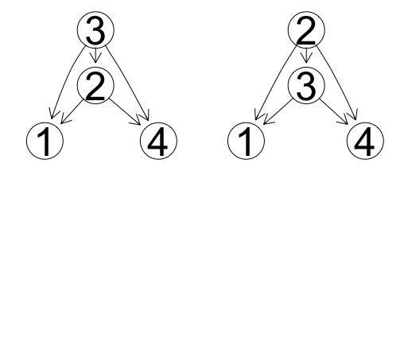
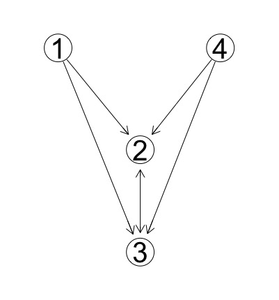
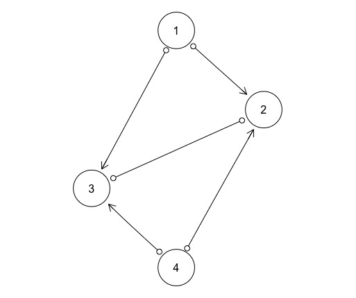
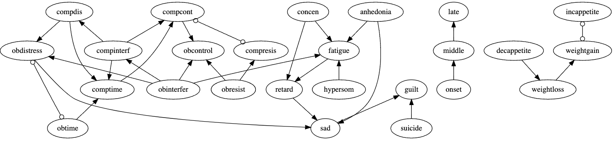

```{r setup, include=FALSE}
knitr::opts_chunk$set(echo = TRUE)

library(DT)
library(qgraph)
library(igraph)
library(networkD3)
```
<style>
u.dotted{
  border-bottom: 1px dashed #999;
  text-decoration: none; 
}
</style>

# Algorithm types

## FCI (Fast Causal Inference)
- **Description**  
FCI is a constraint-based algorithm, which is a generalization of PC algorithm in the sense that it allows latent and selection variables. FCI has two phases: 
  - *Adjacency phase*: The *adjacency phase* starts with a complete undirected graph and then performs a sequence of conditional independence tests that lead to the removal of an edge between any two adjacent variables that are judged to be independent, conditional on some subset of the observed variables.
  - *Orientation phase*: FCI then enters an *orientation phase* that uses the stored conditioning sets that led to the removal of adjacencies to orient as many of the edges as possible. 
 
- **Output format**: Partial Ancestral Graph (PAG)

- **Triple types**:  
  - Solid underline: $A *-* \underline{B} *-* C$ refers to the situation where the pair $A$, $B$, and pair $B$, $C$ are adjacent but not the pair $A$ and $C$, and $B$ is *in* $Sepset(A,C)$. (If $B$ is *not* in $Sepset(A,C)$ then  $A *-> B <-* C$).
  
   
## GES (Greedy Equivalence Search)
- **Description**  
GES is a score-based algorithm that greedily maximizes a score function (typically the BIC) in the space of (observational) CPDAGs in three phases, starting from the empty graph.  
    - *Forward phase*:
In the forward phase, GES moves through the space of essential graphs in steps that correspond to the addition of a single edge in the space of DAGs; the phase is aborted as soon as the score cannot be augmented any more.

    - *Backward phase*:
In the backward phase, the algorithm performs moves that correspond to the removal of a single edge in the space of DAGs until the score cannot be augmented any more.

    - *Turning phase*:
In the turning phase, the algorithm performs moves that correspond to the reversal of a single arrow in the space of DAGs until the score cannot be augmented any more.

GES cycles through these three phases until no augmentation of the score is possible any more.

- **Output format**: Completed Partially Directed Acyclic Graph (CPDAG) 


## CCD (Cyclic Causal Discovery)
\usepackage{ulem}

- **Description**  
CCD is a constraint-based discovery algorithm for directed cyclic graphs.
CCD assumes that the data are causally sufficient (no latent variables) though possibly with directed cycles. No background knowledge is permitted. CCD reasons about cyclic (feedback) models using conditional independence facts alone, as with PC or FCI, so is general in this sense.

- **Output format**: *(Cyclic) PAG*. Note that the output graph contains circle endpoints as with a latent variable PAG, but these are interpreted differently (Richardson, 2013). Edge <->, o->, and <-o don't appear in Cyclic PAG as CCD assumes causal sufficiency (they only appear in PAGs for directed graphs with latent variables). 

- **Triple types**:  
  - Solid underline: $A *-* \underline{B} *-* C$ refers to the situation where the pair $A$, $B$, and pair $B$, $C$ are adjacent but not the pair $A$ and $C$, and $B$ is *in* $Sepset(A,C)$. (If $B$ is *not* in $Sepset(A,C)$ then  $A *-> B <-* C$). It means that B is an ancestor of (at least one of) $A$ or $C$ in $Equiv(G)$.
  - Dotted underline: When $A -> B <- C$, the arrowheads at $B$ are joined by dotted underlining (A -> <u class="dotted">B</u> <- C) only if $B$ is not a descendant of a common child of $A$ and $C$ in every directed graph in $Equiv(G)$.


## CCI (Cyclic Causal Inference)
- **Description**  

    CCI is a constraint-based discovery algorithm for directed cyclic graphs with latent variables and/or selection bias. It can be seen as an extension of FCI.  

    CCI discovers a partially oriented *maximal almost ancestral graph (MAAG)* of some directed graph $G$, provided that the global Markov property and d-separation faithfulness holds according to $G$. Such properties are reasonable when G is the directed graph of a structural equation model with independent errors and linearity holds, for example.

- **Output format**: *Maximal Almost Ancestral Graph (MAAG)*. 


# Graphical representation

## Data Simulation
In order to test algorithms, we will generate data.  
One of the straightforward ways to generate data from a causal model is to use *Structural Equation Model*. We can specify a model with structural equations and randomly sample error terms ($\varepsilon$) according to their distributions. For example,

$$
X_1 = \varepsilon_1,\\
X_2 = B_{21}X_1 + B_{23}X_3 + \varepsilon_2, \\
X_3 = B_{34}X_4 + B_{32}X_2 + \varepsilon_3, \\
X_4 = \varepsilon_4,
$$
,where $\varepsilon$ denotes a set of jointly independent Gaussian error terms and $B$ is a 4 by 4 coefficient matrix.


## Simulated Data

<div class="columns-2">
```{r, data simulation, eval=FALSE}
# simulate data with cycles 
# sim data with p = 4
p = 4
B = matrix(c(0, 0, 0, 0,
             1, 0, 0.5, 0,
             0, 0.5, 0, -.9, 
             0, 0, 0, 0), p, p, byrow = T)
# I - B inverse
A <- solve(diag(4) - B)
# sample errors (std. normal)
errors <- MASS::mvrnorm(n = 1000, 
                        mu=rep(0,4), Sigma=diag(4))
# generate data
data4p <- t(apply(errors, 1, function(x) A %*% x))
```

```{r, echo=FALSE, results='hide', out.width="100%",  fig.cap="True Data Generating Model"}
set.seed(123)

p = 4
B = matrix(c(0, 0, 0, 0,
             1, 0, 0.5, 0,
             0, 0.5, 0, -.9, 
             0, 0, 0, 0), p, p, byrow = T)
dimnames(B) <- list(c("X1", "X2", "X3", "X4"),
                    c("X1", "X2", "X3", "X4"))

layout_mat <- matrix(c(1,5,
                       1,3,
                       3,3,
                       3,5), p, 2, byrow = T)

qgraph(t(B), layout=layout_mat)

# equilibrium check
abs(Re(eigen(B)$values)) < 1
# I - B inverse
A <- solve(diag(4) - B)
# sample errors (std. normal)
errors <- MASS::mvrnorm(n = 1000, mu = rep(0,4), Sigma = diag(4))
data4p <- t(apply(errors, 1, function(x) A %*% x))
colnames(data4p) <- c("X1", "X2", "X3", "X4")
```
</div>

## Directed Acyclic Graph (DAG)
<div style="float: top;">
- Edge types:
->

- Edgemark interpretation:
  - **Blank-Arrow**: These two edgemarks together represent the direction of causation.
</div>

<div style="float: bottom" class="centered">

</div>


## Completed Partially Directed Acyclic Graph (CPDAG) 
<div style="float: left; width: 60%;">
- CPDAG is an equivalence class of DAGs. 

- Edge types:
->, <-->

- Edgemark interpretation:  
  - **Blank-Arrow**: The causal direction is displayed clearly if all members of the equivalence class agree.
  - **Arrow-Arrow**: The causal direction is ambiguous if there is internal disagreement between members of the equivalence class.
  
</div>

<div style="float: right; width: 40%;">

</div>


## Maximal Ancestral Graph (MAG)
- MAG affords for hidden and selection variables.

- Edge types:
–>, <->, —

- Edgemark interpretation:  
    - **Blank-Arrow**: Roughly, these edges come from observed variables.  
    - **Arrow-Arrow**: Roughly, these edges come from hidden variables.  
    - **Blank-Blank**: Roughly, these edges come from selection variables.  
 
## Partial Ancestral Graph (PAG)
<div style="float: left; width: 60%;">

- PAG is an equivalence class of MAGs.
- Edge types:
o-o, o–, o->,–>, <->, —

- Edgemark interpretation:  
    - **Blank **: this blank is present in all MAGs in the equivalence class.  
    - **Arrow**: this arrow is present in all MAGs in the equivalence class.  
    - **Circle**: there is at least one MAG in the equivalence class where the edgemark is a *Blank*, and at least one where the edgemark is an *Arrow*.
</div>

<div style="float: right; width: 40%;">

</div>
    


# Empirical Example
## Empirical Data
Data from McNally et al. (2017) on OCD and depression symptoms will be used to test the algorithms.
See the details of data below in the table. 
```{r, echo=FALSE}
mcnally <- read.csv("McNally.csv")
datatable(mcnally, options = list(dom = 'ltipr', pageLength = 7, scrollX = TRUE))
```

## McNally Statistical Network
```{r, echo=FALSE, fig.show='hide'}
cormat <- cor(mcnally)
glassoFit <- EBICglasso(cormat, n = nrow(mcnally))

glassoNet <- qgraph(glassoFit, layout = "spring", groups = list(Depression = 1:16, OCD = 17:26), 
                    color = c("white", "gray"), label.scale = TRUE, labels = colnames(mcnally),
                    vsize = 5)
```

```{r, echo=FALSE}
net <- as.igraph(glassoNet, attributes = T)
network <- igraph_to_networkD3(net)
network$links$source <- colnames(mcnally)[network$links$source + 1]
network$links$target <- colnames(mcnally)[network$links$target + 1]

networkData <- data.frame(network$links$source, network$links$target)

simpleNetwork(networkData, zoom=T, linkDistance = 250, fontSize = 15, linkColour = "gray")
```

## McNally PAG
We use CCD algorithm and estimate the CPDAG. The plot below shows the estimated CPDAG from McNally data.  
  
    
    

{width="100%"}


## Causal Landscape
<center>
{width=60%}
</center>

## References
<div id="refs"></div>

